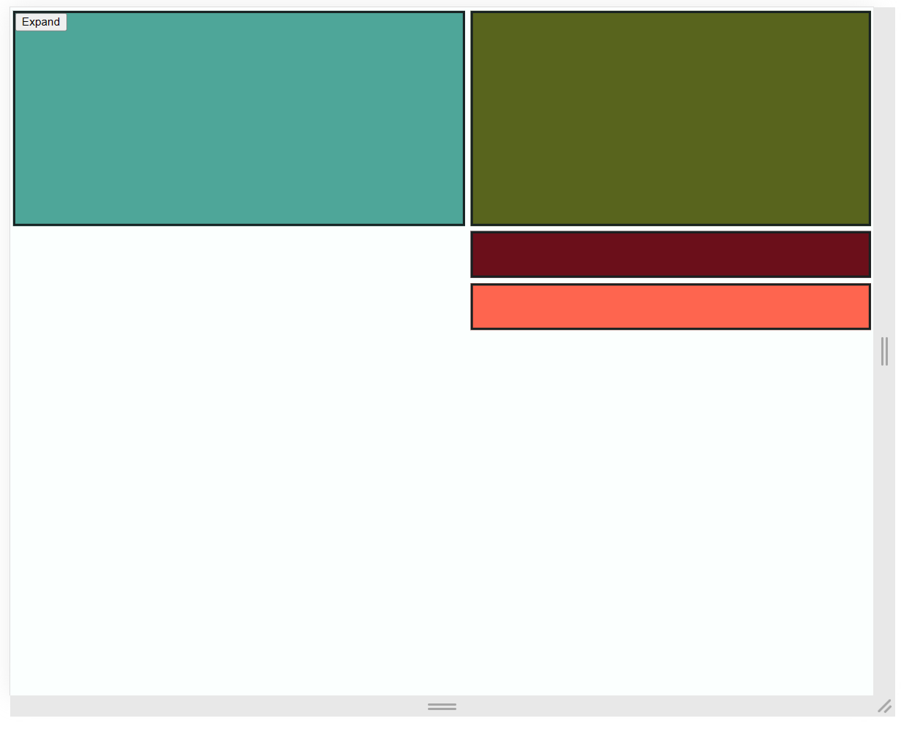

# Endless boxes

A flexbox demo showing how to rearrange containers in a dynamic way to suit viewers on
different devices types

## Cast of Characters

- Teal box ................. Left-aligned on desktop, full-width on mobile
- Green box ................. Right-aligned on desktop, full-width on mobile
- Coral box ................. Right-aligned on desktop, full-width and sticky on mobile

## Demo

<table>
<tr>
<th>Mobile</th>
<th>Desktop</th>
</th>
<tr>
<td valign="top">
<pre lang="graphql">
  
</pre>
</td>
<td valign="top">
<pre lang="jsonc">
  
</pre>
</td>
